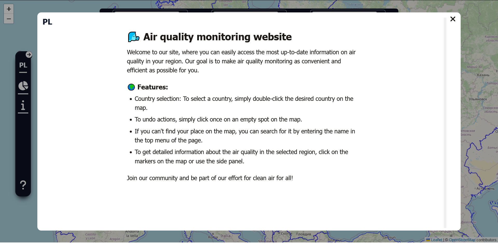
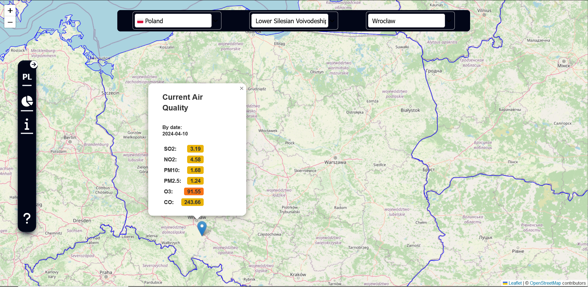
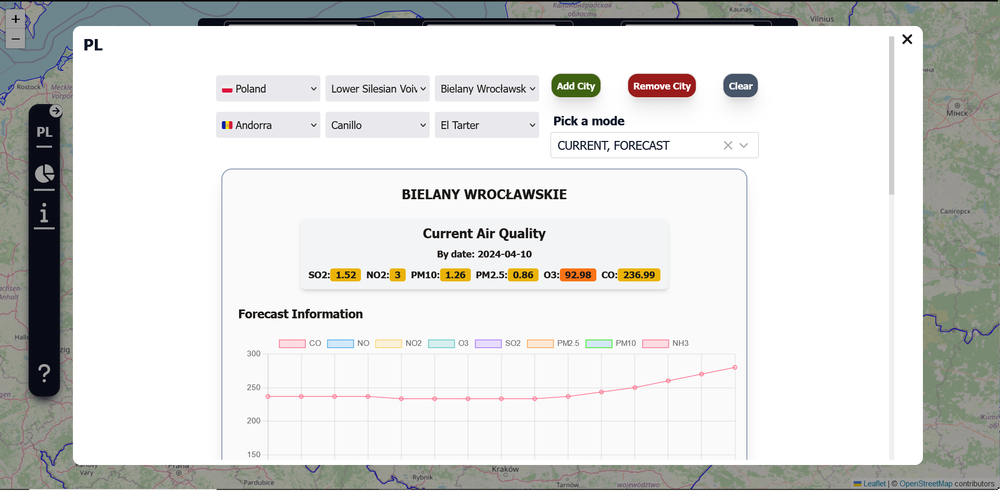
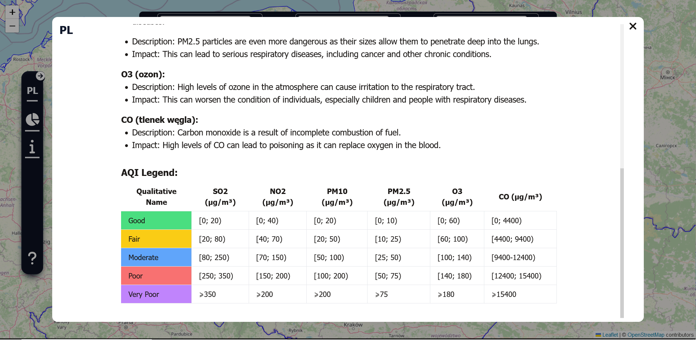

# AirAndHealth
The air quality monitoring system that provides life, forecast and hystorical statistic information about main types of air quality polution as SO2, NO2,	PM10,	PM2.5, O3, and CO whole over the world. Was maden with React.js TaillWindCSS and LeadLet.js

## Home and Q&A Page


Main screen of website represents a short page and map usage manual for better user expirience. 
Every page is provided with translating on two languages as well.

## Map


Here the main Map screen is represented. On this map page you can find every city you would like in few easy ways. Double click the map, choose state, click on city popup or zoom the map to see more! Also you can use the search block on the top of map

## Custom settings page


On this part of website you can choose from 1 to 5 cities to request information about. You can choose your data mode: historycal, forecast or current data. Your can also select all parametrs. The data will be automaticaly changed if some of parametrs will be changed. This page provides you multy axis charts with ability to look through data with special buttons.

## Information Page with Legend



On this page you are provided with all information about each of polutiant. Also you may know what health problems can each of the polutian cose.
On the bottom of the page the multycolar legend is presented for you filled with norms of AQI for each polutiant!

### Running  

To run this project, install it locally cloning repo, than using npm:
```
> cd ./frontend
> npm install
> npm start
```

##Have a Nice Day!

